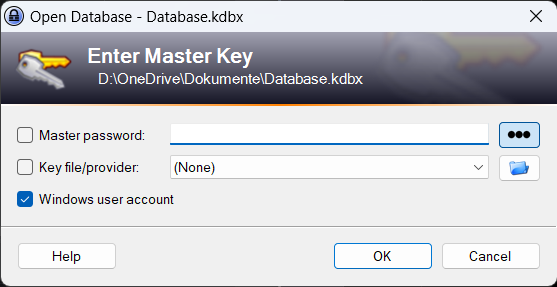
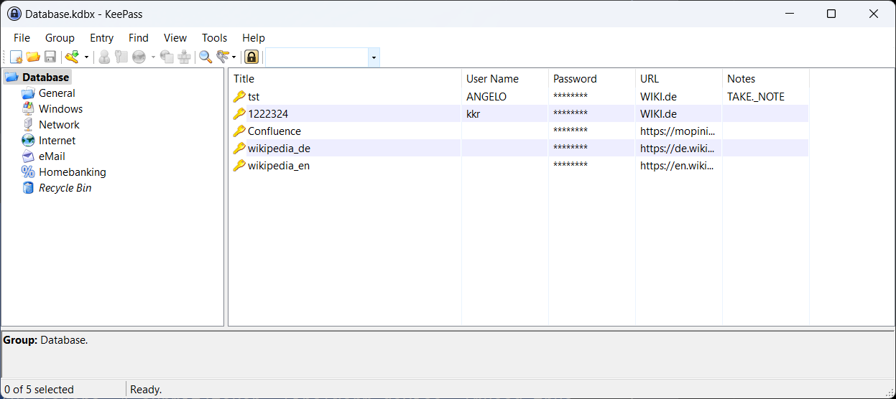
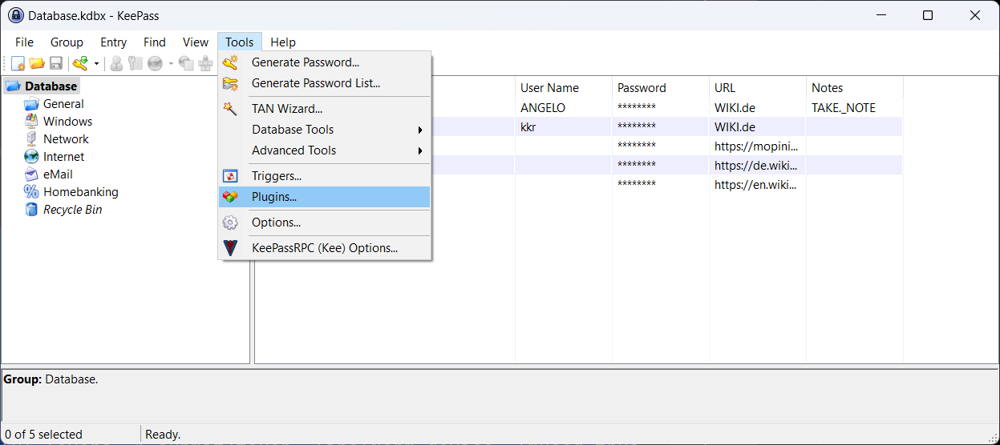
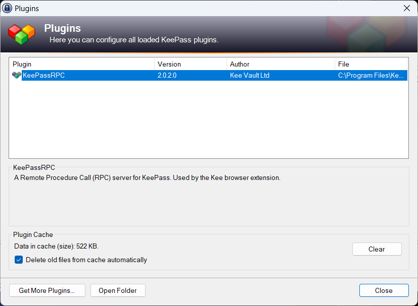
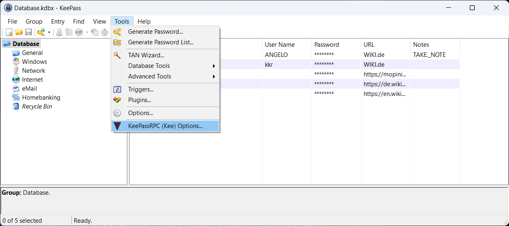
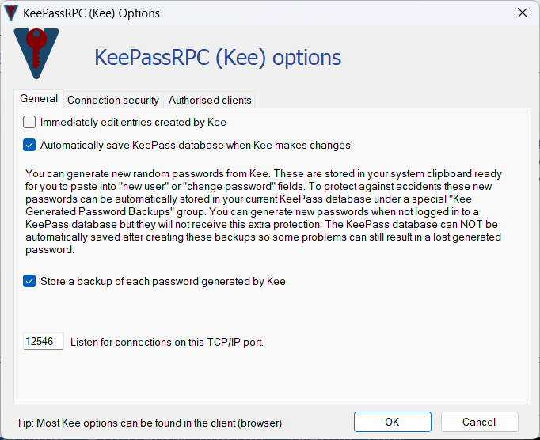
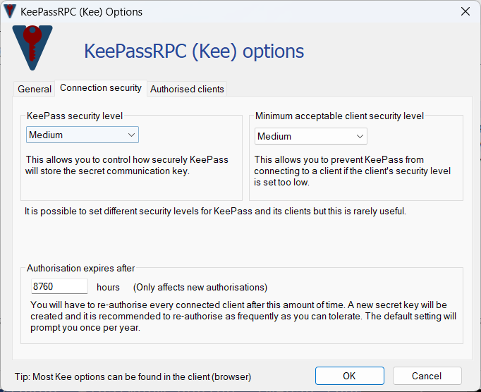
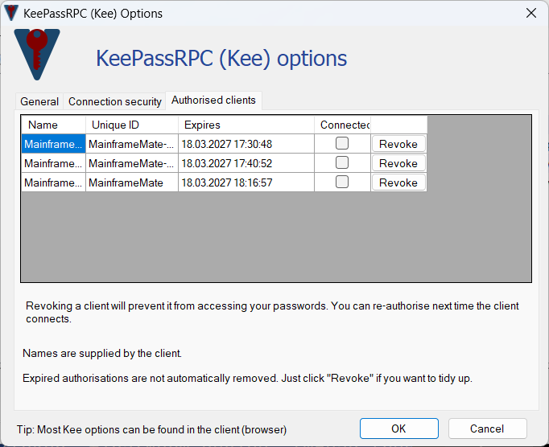

# keepassrpc-java

[](https://central.sonatype.com/artifact/com.aresstack/keepassrpc-java)
[](LICENSE)

`keepassrpc-java` is a lightweight Java 8 library for integrating Java applications with KeePass 2.x through the KeePassRPC plugin. It provides a UI-independent pairing service, a small credential client API, settings value objects, and optional Swing components for desktop applications.

The core design keeps the KeePassRPC pairing workflow outside the UI. Swing dialogs and panels are optional adapters; command-line tools, installers, tests, or other desktop UI frameworks can use the same pairing service directly.

## Installation

### Gradle

```groovy
implementation 'com.aresstack:keepassrpc-java:0.1.0-beta.1'
```

### Maven

```xml
<dependency>
    <groupId>com.aresstack</groupId>
    <artifactId>keepassrpc-java</artifactId>
    <version>0.1.0-beta.1</version>
</dependency>
```

## Status

`0.1.0-beta.1` is the first Maven Central beta release. The public API is usable, but it should still be treated as a beta-level KeePassRPC integration until it has been tested across more KeePass, KeePassRPC, Windows installation, and desktop application scenarios.

The library targets Java 8 bytecode. The Gradle build can run on newer JDKs and uses `--release 8` when the current compiler supports it.

## What is included

- A UI-independent `KeePassRpcPairingService` for KeePassRPC pairing.
- A `KeePassRpcPairingRequest` builder for host, port, origin, client name, and timeout configuration.
- A `KeePassRpcPairingResult` value object containing the endpoint, origin, client ID, and SRP key to persist.
- A `KeePassRpcCredentialClient` API for already paired KeePassRPC connections.
- `KeePassRpcSettings` and `KeePassRpcSettingsRepository` abstractions for application-owned persistence.
- Optional Swing UI components for configuration and pairing.
- A small demo launcher for the extracted Swing settings panel.
- No dependency on an application-specific global settings system.

## Basic pairing usage

KeePassRPC pairing is a two-step flow. First, the Java application starts pairing. KeePass then shows a one-time pairing code to the user. The application passes that code back to the pairing service and receives a reusable SRP key.

The following example intentionally uses `MainframeMate` as the client name because the included KeePass setup screenshots show that name during pairing. Applications should normally replace it with their own product name.

```java
import com.aresstack.keepassrpc.pairing.DefaultKeePassRpcPairingService;
import com.aresstack.keepassrpc.pairing.KeePassRpcPairingRequest;
import com.aresstack.keepassrpc.pairing.KeePassRpcPairingResult;
import com.aresstack.keepassrpc.pairing.KeePassRpcPairingService;
import com.aresstack.keepassrpc.pairing.KeePassRpcPairingSession;

public class PairingExample {

    public static void main(String[] args) {
        KeePassRpcPairingService pairingService = new DefaultKeePassRpcPairingService();

        KeePassRpcPairingSession session = pairingService.startPairing(
                KeePassRpcPairingRequest.builder()
                        .host("127.0.0.1")
                        .port(12546)
                        .origin("chrome-extension://mainframemate")
                        .clientId("MainframeMate")
                        .clientDisplayName("MainframeMate")
                        .build()
        );

        String oneTimeKeyShownByKeePass = askUserForPairingKey();

        KeePassRpcPairingResult result = pairingService.completePairing(
                session,
                oneTimeKeyShownByKeePass
        );

        System.out.println("Pairing completed. Persist this SRP key: " + result.getSrpKey());
    }

    private static String askUserForPairingKey() {
        throw new UnsupportedOperationException("Read the one-time key from your own UI or setup flow.");
    }
}
```

For single-step integration, provide a key callback:

```java
KeePassRpcPairingResult result = pairingService.pair(request, session -> {
    // Show a dialog, prompt in the terminal, or wait for installer input.
    return askUserForPairingKey(session);
});
```

## Persisting pairing results

Pairing results are deliberately plain value objects. The library does not force a persistence mechanism.

```java
KeePassRpcSettings settings = repository.load();
settings.applyPairingResult(result);
repository.save(settings);
```

The persisted SRP key is then used to authenticate future KeePassRPC connections.

## Credential client usage

After pairing, create a credential client from settings or from a pairing result:

```java
import com.aresstack.keepassrpc.client.DefaultKeePassRpcCredentialClient;
import com.aresstack.keepassrpc.client.KeePassRpcCredentialClient;

try (KeePassRpcCredentialClient client =
             DefaultKeePassRpcCredentialClient.fromSettings(settings)) {
    client.connect();

    String userName = client.getUserName("Example Entry");
    String password = client.getPassword("Example Entry");
}
```

The credential client is intentionally small. It wraps the KeePassRPC protocol calls needed by typical application integrations and can be expanded without changing the pairing API.

## Optional Swing UI

Swing is optional. The package `com.aresstack.keepassrpc.ui` contains a settings panel that can be embedded in desktop applications, while `com.aresstack.keepassrpc.client.KeePassRpcPairingDialog` is an adapter around the pairing service.

The intended dependency direction is:

```text
application / Swing / CLI / installer
    ↓
pairing service API
    ↓
KeePassRPC protocol client
```

The pairing service does not depend on Swing. A Swing button should collect values, build a `KeePassRpcPairingRequest`, call the service, persist the `KeePassRpcPairingResult`, and update the UI.

## KeePass and KeePassRPC setup

KeePassRPC must be installed into KeePass 2.x before pairing can work. The plugin file normally belongs in the KeePass plugin directory, for example:

```text
C:\Program Files\KeePass Password Safe 2\Plugins
```

Use the actual KeePass installation directory if KeePass was installed elsewhere.

The screenshots below show the KeePass-side configuration flow. They are documentation images only; they do not define application defaults except where the example client name is visible.

### 1. Unlock the KeePass database



Open KeePass and unlock the database with the master key before starting pairing.

### 2. Verify that the database is open



KeePassRPC can only pair and answer credential requests while KeePass is running and the database is available.

### 3. Open the plugins dialog



Use `Tools` → `Plugins` to verify that the plugin is installed.

### 4. Check that KeePassRPC is listed



If KeePassRPC is missing, copy the plugin to the KeePass plugin directory and restart KeePass.

### 5. Open KeePassRPC options



Use `Tools` → `KeePassRPC Options...` to review the plugin configuration.

### 6. Review the general options



The default KeePassRPC listener port is `12546`. Keep automatic save enabled if generated or updated credentials should be persisted immediately.

### 7. Review connection security



KeePassRPC validates the WebSocket `Origin` header. Use an origin that matches the application configuration.

### 8. Review authorised clients



The authorised clients tab lists paired clients. Revoke old or invalid authorisations before pairing again.

## Logging

The library depends on `slf4j-api` but does not bundle a logging backend or a `logback.xml`. Applications should provide their own backend. Logback is a suitable default for desktop applications:

```groovy
runtimeOnly 'ch.qos.logback:logback-classic:1.2.13'
```

## Build from source

```bash
bash ./gradlew clean build
```

For the ChatGPT-compatible release package, use the offline build script included in the ZIP:

```bash
bash ./chatgpt-build.sh
```

## Publish locally

```bash
bash ./gradlew publishToMavenLocal
```

For a local staging repository under `build/staging-deploy`:

```bash
bash ./gradlew publish
```

The Gradle build creates the normal JAR, sources JAR, Javadoc JAR, Maven POM, and optional signatures for non-SNAPSHOT release builds.

## Runtime dependencies

- `com.google.code.gson:gson:2.8.9`
- `org.java-websocket:Java-WebSocket:1.5.2`
- `org.slf4j:slf4j-api:1.7.32`

## License

`keepassrpc-java` is released under the MIT License. See [LICENSE](LICENSE).
